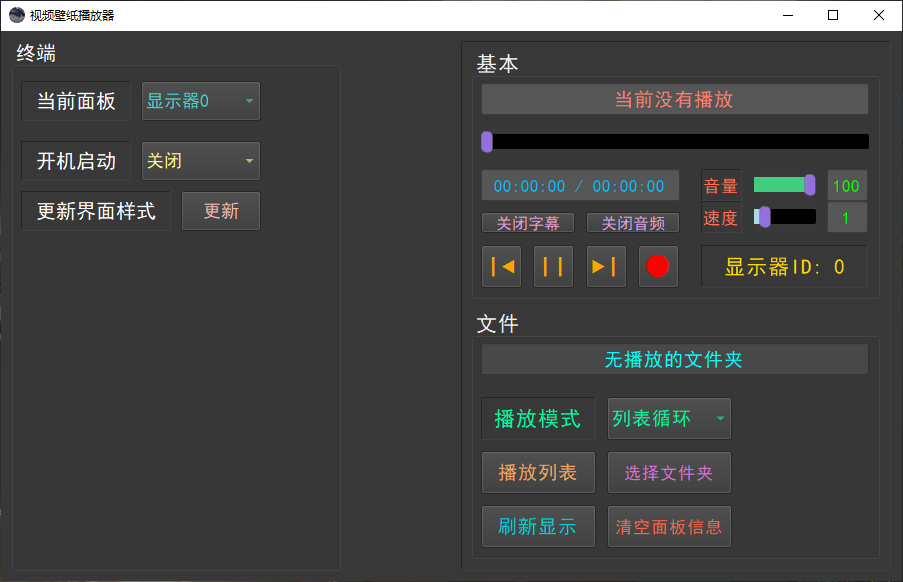
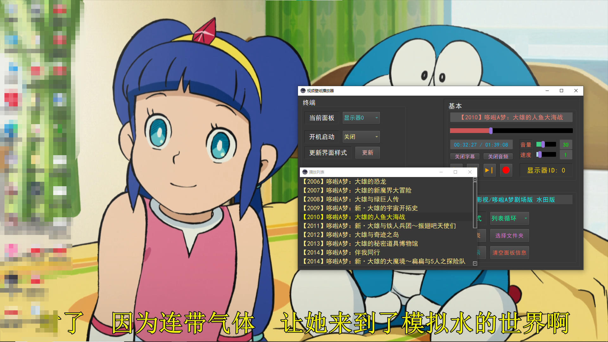
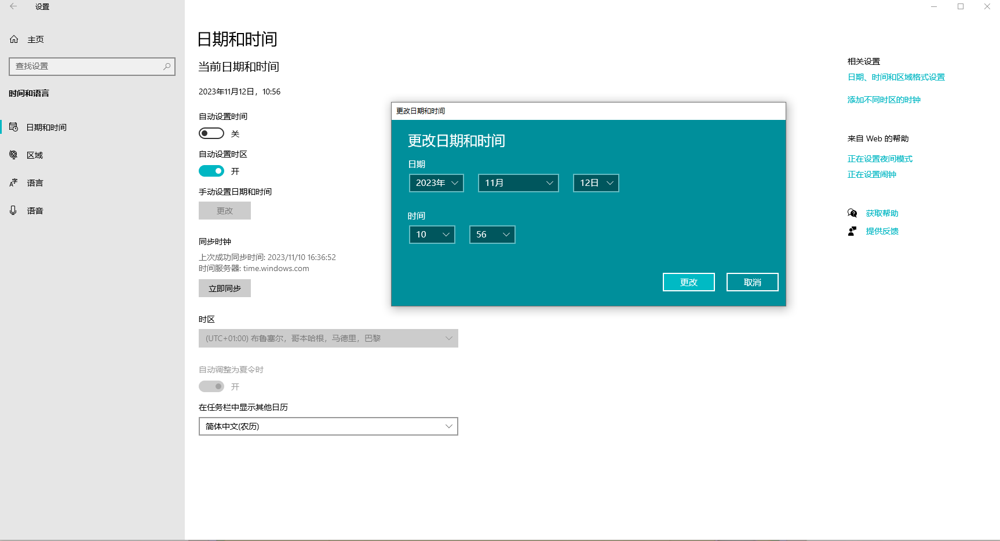

# MediaWallpaper 视频壁纸播放器

## *将播放视频投射在桌面上的播放器*

  

---

## 原理及依赖

播放器投射原理同 **墙纸引擎**( *Wallpaper Engine* )  

媒体播放层依赖***mpv***视频播放库(版本 *0.36.0*)  

界面交互层依赖***Qt***图形库(版本 *5.15.2*)  

使用 C++ 编写(C++ 11 为主)  

[关于投射原理详见此文件](document/Principle.h)  

---

## 基本

支持多个屏幕同时播放, 开机自启动, 自定义CSS样式表, 以及程序运行期间更新界面CSS样式  

程序退出时会自动保存当前播放的关键数据(时间、音量、播放速度等)  

主窗口和播放列表窗口支持窗口大小记忆  

支持时间、速度、音量调整  

支持音频开关及字幕开关  

支持自定义参数调整  

仅使用本地资源播放  

### 程序截图

  
主界面  

  
播放列表  

  
播放演示  

### 注意

托盘形式为启动后默认形式, 如需调整媒体播放参数, 请双击打开界面,  

或右键打开菜单, 点击 **显示** 打开界面。  

---

## 使用方法

### 播放视频

1. 打开程序
2. 在终端组中选择想要投射的显示器
3. 点击 "选择文件夹" 按钮, 弹出一个选择窗口
4. 选择想要播放的 **视频** 文件夹后点击选择文件夹
5. 视频将自动播放, 可通过面板调整视频的音量、速度等参数

### 切换面板与开机自启动

1. 在终端组中有两个选项: **当前面板** 和 **开机启动**;  
2. **开机启动** 选项控制系统启动时启动程序;  
3. **当前面板** 选项控制右侧的面板窗口。  

### 注意事项

如打开 **开机启动** 选项, 程序将在注册表中写入启动信息  

关闭选项时将自动删除  

---

## 关于自动保存

### 面板

每个面板对应一个数据文件, 文件均存放于程序根目录的 ***mediaData*** 文件夹中  

播放视频的数据将在程序退出时或关机时, 自动保存至对应的数据文件  

### 程序主界面

主界面支持大小记忆, 数据存放于程序根目录的 ***mainWindow.dat*** 文件中  

程序退出时或关机时会自动保存到文件中

### 注意事项

保存的数据文件均为二进制形式,  

任何以非二进制打开并保存的方式将可能破坏文件内容  

---

## 关于参数文件(.conf)

每个面板对应一个参数文件, 文件均存放于程序根目录的 ***mediaData\config*** 文件夹中  

这些参数文件会在程序启动时读取一次, 可点击 **刷新显示** 按钮读取更新  

### 注意事项

参数文件为文本格式, 且不会在程序启动时自动创建, 请自行创建  

### 参数文件命名规范

screen#X.conf (X 为显示屏索引, 从0开始计数)  

### 参数设置参考

中文(第三方): https://hooke007.github.io/

官方: https://mpv.io/manual/master/

---

## 关于样式表

[样式表详见该文档](document/CSS.md)

---

## 已知的问题

### 请勿在程序运行期间修改系统时间

*程序会异常卡死，原因不明*  

修改系统时间的例子: **无主之地3的黑市贩卖机Bug**  

### 仅支持 Windows 64位系统, Linux系统暂不支持(没用过)

程序播放视频时将占用至少 **100 MB** 大小的运行内存  

如有多个屏幕播放视频, 建议拥有至少 **32 GB** 大小的运行内存  

---