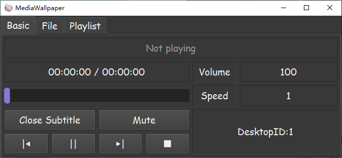

# MediaWallpaper

## English Version

---

## Principle and Dependencies

### Principle

Insert the media widget into the gap between the desktop icon layer and the wallpaper layer,  
same as ***Wallpaper Engine***  

### Dependencies

Media player layer: ***mpv*** media lib(Version: *0.36.0*)  

GUI layer ***Qt*** GUI lib(Version: *5.15.2*)  

Compiled by C++(Version: C++ 14)  

[Detail of the principle](Principle.md)

---

## Function(s)/Feature(s)

1. Multi-monitors playing  
1. Auto-start at system boot  
1. Custom GUI style-sheet  
1. Saving playing data automatically  
1. Memorable GUI size  
1. Operation of muting and subtitle  
1. Expandable media playing configuration  
1. All-time Offline, only depends on local resources  

## Runtime screenshot

---

---

---

---

## Usage

### Playing the video

1. Open the program  
1. Click "File"  column at the main window  
1. Click "Select a directory", and a window will popup  
1. Select the directory you want to play, and then click "select"  
1. Congratulations, the video will play automatically, now you can modify the arguments(volume, speed, etc.) at main window  

### Panels switchover and auto-start at system boot

1. There are **Current panel** and **Auto-start** options in terminal  
1. **Auto-start** sets the option of auto-start at system boot  
1. **Current panel** controls the display of main window  
1. The tray icon can also control the display of main window, see **Show panel** option  

### Attention!

The program will write the information to "regedit" while setting auto-start  

The information will be deleted while the option is "OFF"  

---

## Auto-save

The program will save all the information(info) automatically while shutdown and exit  

All the info will be stored in directory "***mediaData***" of the root  

File "**ProgramInfo.json**" saves the info of the main window and the terminal  

File "**PanelInfo.json**"  saves the info of every panel  

### Files for expandable video playing arguments(.conf)

All the files are located at the directory "***mediaData/config***" of the root  

All the arguments will be loaded while click the button "**Refresh display**"  

### Attention!

The format of saving the arguments is text, please take the research of the reference manual in **mpv.io**  

### Reference manual

https://mpv.io/manual/master/

---

## Custom style-sheet

The program offers six file-interfaces, which are all located in the directory "**resources/stylesheet/**" of the root  

The description of those file-interfaces:  

| Name | File | Description |
| :-: | :-: | :-: |
| BasicWidget | BasicWidget.css | Basic playback control |
| FileWidget | FileWidget.css | Playing files control |
| MainWindow | MainWindow.css | Main window |
| MediaWidget | MediaWidget.css | Background of media widget |
| PlaylistWidget | PlaylistWidget.css | Playlist |
| TerminalWidget | TerminalWidget.css | Terminal |
| DirInfoWidget | DirInfoWidget.css | Widget inside the page "file", named "directory list" |

---

## Unsolved problem(s)

### Conflict with "RivaTuner Statistics Server"

There is the conflict of drawing the graphics between RivaTuner and the program  

The conflict will result in the crash of the program  

---

### Modify the system time

The player layer will be stacked, and the principle is not found yet  

---

### Linux is currently not supported, it will be done in the future

---
