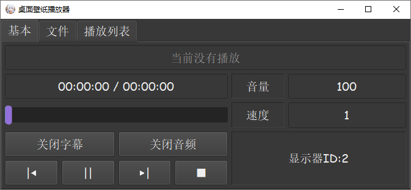

# MediaWallpaper 视频壁纸播放器

## 简体中文版本

---

## 原理及依赖

将视频播放的窗口插在桌面图标与壁纸之间, 同 ***Wallpaper Engine: 墙纸引擎***  

媒体播放层依赖 ***mpv*** 媒体播放库(版本 *0.36.0*)  

图形交互层依赖 ***Qt*** 图形库(版本 *5.15.2*)  

使用 C++ 编写(版本 C++ 14)  

[原理详见此文件](Principle.md)

---

## 功能/特性

1. 多屏幕同时播放  
1. 开机自启动  
1. 自定义界面样式  
1. 播放数据自动保存  
1. 窗口大小记忆  
1. 一键静音与关闭字幕  
1. 可拓展视频播放参数  
1. 完全离线，仅依靠本地资源  

## 运行截图

---

---

---

---

## 使用方法

### 播放视频

1. 打开程序界面  
1. 主窗口中, 点击 "文件" 栏  
1. 点击 "选择文件夹" 按钮后弹出选择窗口  
1. 选择要播放的目录后点击 "选择文件夹"  
1. 视频将自动播放, 可通过面板调整视频的音量、速度的参数  

### 切换面板与开机时启动

1. 终端界面有 **当前面板** 和 **开机启动** 等选项  
1. **开机启动** 用于设定程序在系统启动时运行  
1. **当前面板**  选项控制主窗口的面板, 面板与显示器上播放的内容一一对应  
1. 右键托盘, **面板显示** 选项也可控制主窗口的面板  

### 注意

打开 **开机启动** 选项, 程序将在注册表中写入启动信息  

选项关闭时将自动删除  

---

## 自动保存

程序会在退出和关机时自动保存数据  

所有数据将存放在程序根目录的 ***mediaData*** 文件夹中  

其中, **ProgramInfo.json** 储存主界面与终端相关的信息  

**PanelInfo.json**  储存每个面板的相关信息  

*除mediaData/config文件夹外, 所有数据均以 **json** 格式储存*  

### 可拓展视频播放参数文件(.conf)

参数文件均位于程序根目录的 ***mediaData/config*** 文件夹中  

参数文件可在程序运行期间点击 **刷新显示** 按钮读取  

*参数文件为文本格式, 编写规范请参考 mpv 播放库的操作手册*  

### 参数设置参考

中文(第三方): https://hooke007.github.io/

官方: https://mpv.io/manual/master/

---

## 自定义样式

程序提供六个可调整的文件接口, 均位于根目录的 **resources/stylesheet/** 中,分别是:

| 名称 | 文件 | 描述 |
| :-: | :-: | :-: |
| BasicWidget | BasicWidget.css | 基本播放控制界面 |
| FileWidget | FileWidget.css | 播放文件控制界面 |
| MainWindow | MainWindow.css | 主窗口界面 |
| MediaWidget | MediaWidget.css | 播放窗口背景 |
| PlaylistWidget | PlaylistWidget.css | 播放列表 |
| TerminalWidget | TerminalWidget.css | 终端界面 |
| DirInfoWidget | DirInfoWidget.css | 目录列表 |

---

## 已知问题

### 与应用 "RivaTuner Statistics Server" 出现图形绘制冲突

应用在视频窗口上绘制硬件信息, 将导致本程序崩溃  

关闭应用的硬件监控信息显示可解决问题  

---

### 请勿在程序运行期间修改系统时间

*播放层会异常卡死, 原因不明*  

修改系统时间的例子: **无主之地3黑市贩卖机Bug**  

---

### 暂不支持Linux系统, 还处于研究阶段

---
